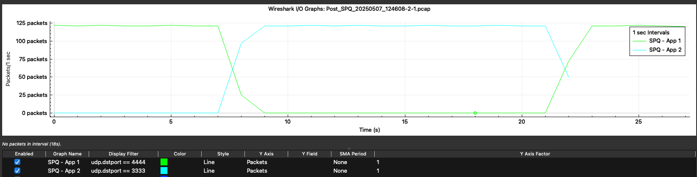
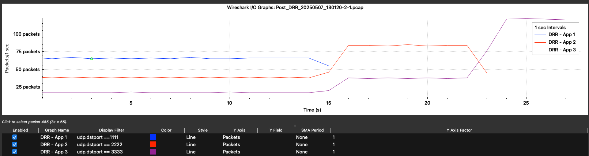

# Table of Contents
* [Overview](#overview)
* [Developer](#overview)
* [Requirements](#requirements)
* [Run Instructions](#run-instructions)
* [Functionality and Design](#functionality--design)
* [Limitations](#limitations)
* [Citations](#citations)
* [UML Deviations](#uml-deviations)
* [Config Files](#config-files)
* [Validation](#validation)
* [Design Recommendations](#recommended-diffserv-improvements)

---
# Overview

This project extends the NS-3 network simulator with a modular Differentiated Services (DiffServ) framework. At its core is a DiffServ abstract base class—derived from ns3::Queue[Packet]—that models packet classification and scheduling. Incoming packets are sorted into one of many TrafficClass queues via a configurable set of FilterElement rules (e.g., source/destination IP or port, protocol number). The base class provides a Classify(pkt) hook to assign packets to queues and a pure-virtual Schedule() method to pick which queue’s head-of-line packet should be served next. By overriding the protected DoEnqueue/DoDequeue/DoRemove/DoPeek hooks, DiffServ integrates seamlessly with NS-3’s built-in drop-tail, tracing, and callback machinery.

Building on this foundation, two concrete QoS mechanisms are implemented: Strict Priority Queuing (SPQ) and Deficit Round Robin (DRR). The SPQ subclass simply implements Schedule() to always drain the non-empty queue with the highest priority (lowest priority number). The DRR subclass maintains per-queue byte-deficit counters (quantums), updates them round-robin based on configured weights, and overrides DoEnqueue() and DoDequeue() to keep its internal deficit state in sync. Both SPQ and DRR accept external configuration via JSON files specifying queue counts, priorities or quantum values, and filter rules. Finally, a suite of automated NS-3 simulation scripts runs a three-node topology (4 Mbps → 1 Mbps) under bulk-transfer workloads to validate that SPQ enforces strict priority and DRR achieves weighted fairness as expected.

---
# Developer

- Chase Chemero (USFCA)

--- 
# Requirements

- NS3 (v3.42) - Recommend Using the All-in-One Tarball (https://www.nsnam.org/releases/ns-3-42/)
- Niels Lohmann's Json for C++ (v3.12.0) (Bundled w/ this Application) (https://nlohmann.me>)
- Python3 (>= v3.13.3)
- CLang (Version for Mac): arm64-apple-darwin24.4.0
- CMake (>= 4.0.1)

--- 
# Run Instructions
1. Unzip the Repo
- Ex: unzip [FileName].zip
2. Place the 'diffserv' folder in NS3 scratch
- Folder Structure should look like this: '<b>ex:</b> /Users/chemch/ns-allinone-3.42/ns-3.42/scratch/diffserv/'
3. Navigate to the NS3 root directory (<b>ex:</b> /Users/chemch/ns-allinone-3.42/ns-3.42)
4. Run the application using the NS3 Command Line (2 Modes Available: Test or Simulation)
- <u>How to Run Unit Tests:</u> ``` ./ns3 run scratch/diffserv/main -- --runMode=test  ```
- <u>How to Run DRR Simulation:</u> ```./ns3 run scratch/diffserv/main -- --runMode=sim --configFile=scratch/diffserv/drr-config-1.json ```
- <u>How to Run SPQ Simulation:</u> ``` ./ns3 run scratch/diffserv/main -- --runMode=sim --configFile=scratch/diffserv/spq-config-1.json ```

---
# Functionality & Design

## DiffServ Methods
1. Schedule -> Pure Virtual Method: Overriden by SPQ and DRR Implementations
* Returns q_class[idx].Peek() which returns Pkt

2. Classify -> Applies TrafficClass Filters to Match Packets to Queue
* Returns Queue Index

3. RegisterQueue -> Adds the provided TrafficClass to the q_class vector
* Returns void

4. Enqueue -> Calls Overriden Queue Base DoEnqueue() per Project Specs which calls Classify and then q_class[idx].Enqueue()
* Returns bool (confirming successful enqueue of packet)

5. Dequeue -> Calls DoDequeue() -> Schedule() to get next packet -> Classify() to get next packet index -> q_class[idx].Dequeue()
* Returns Pkt

6. Peek -> Gets a copy of the next scheduled packet (does not Dequeue)
* Returns Pkt

### SPQ Specifications
1. Overrides Schedule()
* Logic => Loops over all queues to find Highest Priority Queue (Lowest Number) and Returns that Pkt via Peek()
2. Adds GetQueues Method to Get All Queues which is used in Schedule logic 
* This method should probably be in the base DiffServ class as it is necesary for both subclasses
* Added a note in the recommended improvements section [Design Recommendations](#recommended-diffserv-improvements)

### DRR Specifications
1. Overrides Schedule()
* Logic => In the DRR subclass, Schedule() uses two parallel vectors—queueQuantums (the committed byte‐credit for each queue) and its working copy tempDeficitCounter—to walk the queues in a round-robin fashion, adding each queue’s weight to its deficit in tempDeficitCounter until the head-of-line packet size fits, then returns that packet without removing it. 

2. Overrides RegisterQueue
* Additionally adds new queue to deficitCounter vector

3. Overrides Dequeue
* Rolls the current position forward on the active queue and queue quantum vector (essentially moves to next candidate transmitter)
* When Dequeue() is called, it invokes Schedule(), calls Classify() on the scheduled packet to identify its originating TrafficClass, and then pops it; at that point DRR commits the new tempDeficitCounter values back into queueQuantums and advances currentQueue so the next round starts from the correct position.

---
# Limitations
- This implementation meets all the project specifications and validation requirements as outlined. 
- If pushed to Production/integrated w/ NS3 then we would likely want to update Simulation to allow for n number of SPQ TrafficClasses. The current implementation only supports 2 (which is specified in the PDF requirements).
--- 
# Citations
- Credit to Niels Lohmann for the Json Config Parsing Libary -- Reference: [Requirements](#requirements)
- DRR Algorithm Follows PseudoCode on Wikipedia: https://en.wikipedia.org/wiki/Deficit_round_robin
- Setting Up Multi-Queue Networks in NS3: 

Imputato, P., & Avallone, S. (2017). Traffic Differentiation and Multiqueue Networking in ns-3. In Proceedings of the 2017 Workshop on ns-3 (pp. 79–86). ACM. https://doi.org/10.1145/3067665.3067677

- SPQ Mechanism Functionality and Details:

Chang, R., Rahimi, M., & Pournaghshband, V. (2015). Differentiated Service Queuing Disciplines in NS-3. Advanced Network and Security Research Laboratory, California State University, Northridge. Retrieved from https://www.cs.usfca.edu/vahab/resources/simul15_paper.pdf

- DRR Mechanism Functionality and Details:

Shreedhar, M., & Varghese, G. (1995). Efficient Fair Queuing using Deficit Round Robin. In Proceedings of the Conference on Applications, Technologies, Architectures, and Protocols for Computer Communication (SIGCOMM ’95) (pp. 231–242). ACM. https://doi.org/10.1145/205287.205316

- Example of DRR Implementation by Vilas Bhat from Carnegie Melon: https://github.com/vilas897/Implementation-of-Deficit-Round-Robin-in-ns-3/blob/master/ns-3/src/traffic-control/model/drr-queue-disc.h

- Used Copilot in VSCode for Adding Comments, Refining Unit Tests, and Method Auto Populations (on simple Methods Like RegisterQueue)

---
# UML Deviations

- <b>DiffServ Classify()</b> is not set as a pure virtual method as the DiffServ Base class is able to implement concrete functionality required by all base classes. Forcing sub-classes to each implement the same logic would be wasteful and violate the DRY principle. 
- <b>DiffServe RegisterQueue()</b> was added to allow all sub classes to add new Traffic Classes (Queues) to the q_class vector. This should be on the UML Diagram as most subclasses benefit from centralized queue management. Note: This could've also been done with GetQueues which likely all sub classes would need.
- <b>TrafficClass Get/Set<Member>()</b> has Getters/Setters added for the Filter Elements. This allows the configuration attributes to be applied to the queue as it is being created or modified. 
- <b><All Classes> Match()</b> have had their method changed to have the first letter (M) capitalized. NS3 follows a standard convention of having the first letter of Methods capitalized but the UML diagram shows the method as 'match', not 'Match. Not sure if this is a typo, but NS3 convention dictates 'Match'.

---
# Config Files
- Json was used for configuration files. For each DiffServ QOS Mechanism(SPQ and DRR) there 2 config files. 
- The primary validation files are generated using the first config files (spq-config-1.json and drr-config-2.json). The secondary config files were for testing more complex scenarios like best effort class starvation. These configs are just for examining the queue behaviors on edge case input. 
- Config files follow this format: (Note: You need either Weight or Priority depending on Type)

```json
{
    "QoS": {
      "Type": "<DRR or SPQ>",
      "Queues": [
        {
          "no": 1,
          "MaxPackets": <Max Packets You Want for this TrafficClass>,
          "Weight": <Quantum for DRR, Ignored for SPQ>(Optional),
          "Priority": <Integer Priority Where Lower is Better>(Optional),
          "Default": <Set as Default Queue for UnMatched>,
          "DestPort": <FilterElement>
        },
        {
          "no": 2,
          "MaxPackets": <Max Packets You Want for this TrafficClass>,
          "Weight": <Quantum for DRR, Ignored for SPQ>(Optional),
          "Priority": <Integer Priority Where Lower is Better>(Optional),
          "Default": <Set as Default Queue for UnMatched>,
          "DestPort": <FilterElement>
        }
      ]
    }
  }
```

--- 
# Validation

## Topology Layout: 
```

    +-------+         Link0          +---------+         Link1          +-------+
    | Node0 |────────────────────────| Router0 |────────────────────────| Node1 |
    +-------+     (4 Mbps,10 ms)     +---------+     (1 Mbps,10 ms)     +-------+
                                                   │
                                                   │  QoS Scheduler
                                                   ▼
                                            [ SPQ or DRR ]

```


### SPQ Validation: 
- 2 Bulk Data Transfer Apps (App 1 - Dest Port 4444 and App 2 - Dest Port 3333)
- Router0 applies High Priority to App 2 (3333) and Low Priority to App 1 (4444)
- App 1 starts at 2 Seconds After Sim Start, App 2 starts at 10 Seconds After Sim Start
- Results show that on Post SPQ QOS, App 2 gets full bandwidth and App 1 traffic temporarilily goes to 0
- Once App 2 packets are exhausted, then the best effort (App 1) regains the full bandwidth



> Note: These results can be generated using the spq-config-1.json configuration file. 

### DRR Validation:
* 3 Queues instantiated with 300, 200 and 100 weights (thereby enforcing the ratio requirement)
- Queue (App) 1 has Destination Port 1111 and Weight (Quantum) of 300
- Queue (App) 2 has Destination Port 2222 and Weight (Quantun) of 200
- Queue (App) 3 has Destination Port 3333 and Weight of 100 (also set to the Default Queue on No Filter Match)
- All 3 Apps (Queues) Start at Sim Start + 2 Seconds



> Note: These results can be generated using the drr-config-1.json configuration file.

To examine how queue starvation works you can run either <b>spq-config-2.json or drr-config-2.json</b>. I used those just to validate the QOS behavior on edge case. 

---
# Recommended DiffServ Improvements
1. Add RegisterQueue Method to DiffServ Class:
The DiffServ class could benefit from having the RegisterQueue method officially added. Without this I wasn't sure on the intended method for adding queues after instantiation. 
2. Add Helper Functions on TrafficClass Class:
Setting and Getting TrafficClass members is essential for storing or changing configuration on the queue. The members are mutable and I wouldn't expect them to only get set at instantiation time. 
3. Don't Make Classify a Pure Virtual Method:
The base DiffServ class can define Classify logic that will work for most sub-classes. By defining the method as pure virtual, all sub-classes must implement their own logic, which in most cases will be the same. 
4. Add Longest Match to Filters:
Currently, either Filter A or Filter B are expected to match the packets, however, practical cases will
likely be more complex. I would expect that there will be scenarios where multiple filters match a packet and the engineer would like the Longest Match to take precedence. This would be similar to Longest Match on Subnet Masks where the Filter with the Longest Filter Element Vector that matches is the one selected. 
5. Add a PeekSchedule to Run the Schedule Logic but not Change Internal State:
I noticed an issue when building unit tests whereby calling Schedule and Dequeue separately on the DRR class results in the return of incorrect packets (or null pointers). The problem is that both Scheduling and Dequeuing share internal state, so calling them out of order breaks that state machine. Because Schedule() has side‐effects on nextQueue and the temporary deficit counter vector, calling it once and then calling Dequeue() will actually run the scheduling logic twice. In particular:
- Schedule() - only peeks and updates the round-robin quantum & deficit state, but it does not actually remove anything from the queues.
- Dequeue() - calls Schedule() internally, then immediately uses that freshly computed schedule to remove one packet and commit the new cursor and deficit values.
